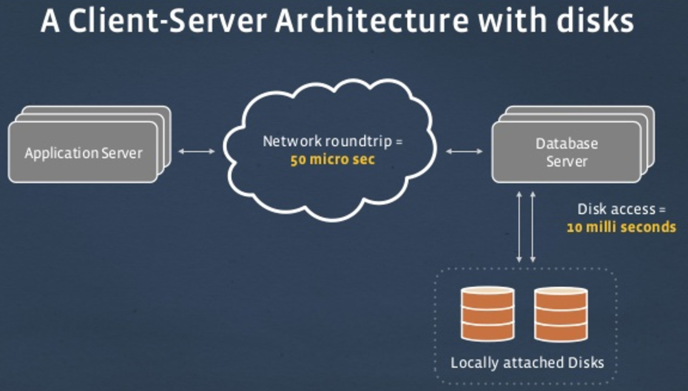
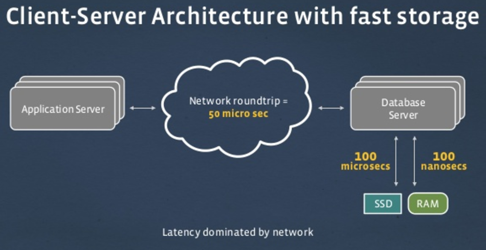
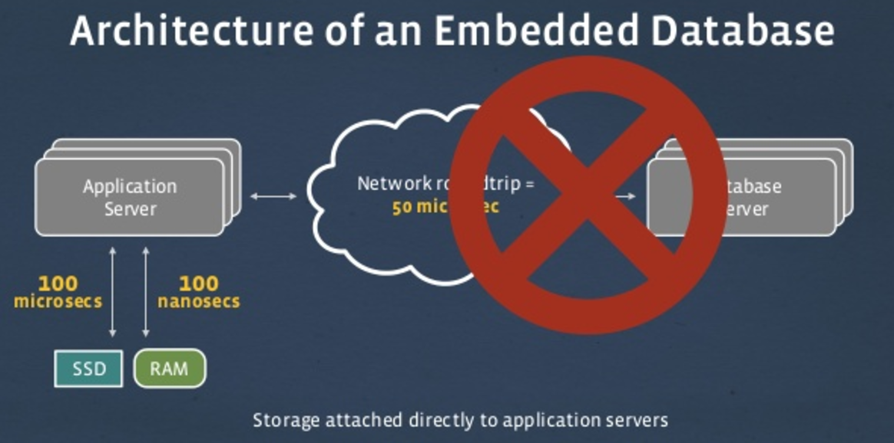
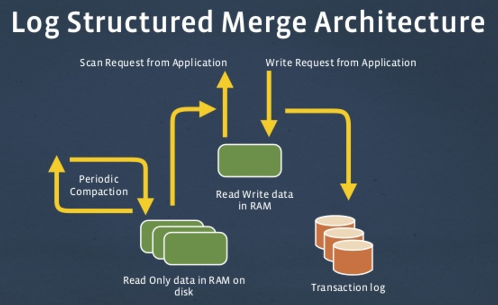
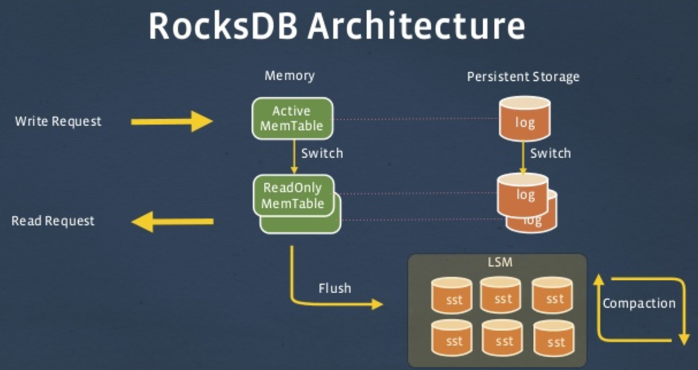

<h2>Table of Contents</h2>

<ul>
<li><a href="#org990423b">1. Introduction</a></li>
<li><a href="#org3bac5e7">2. Backstory - Flash</a></li>
<li><a href="#orgefa3888">3. Backstory - latency</a></li>
<li><a href="#orge8d663f">4. Backstory - latency</a></li>
<li><a href="#org0f98cc1">5. Backstory - no latency!</a></li>
<li><a href="#orga60230e">6. Backstory - LSM</a></li>
<li><a href="#orgd19c279">7. Backstory - LevelDB</a></li>
<li><a href="#org75aedce">8. RocksDB Development in Facebook</a></li>
<li><a href="#org46663e5">9. RocksDB architecture</a></li>
<li><a href="#orgb88b8df">10. RocksDB what it's not</a></li>
<li><a href="#org0d73e6e">11. Performance</a></li>
<li><a href="#org7e88ed0">12. Where is it used?</a></li>
<li><a href="#orga7dcafe">13. Code/Demo</a></li>
<li><a href="#org4ac87bb">14. Where is RocksDB going?</a></li>
<li><a href="#orgc39003b">15. What's the plan for rocksdb-node?</a></li>
<li><a href="#org99d663e">16. RocksDB &amp; Node.js - Exponential Disruption!</a></li>
</ul>

# Introduction

-   RocksDB Backstory
-   RocksDB & Node.js
-   Code/Demo
-   Disruptions!

# Backstory - Flash

-   Flash - massively disruptive
-   NVM-E arrays mainstream
-   Data migrating
-   SSD 200x improvement
-   Problem: Write amplification
-   Problem: Endurance problems

# Backstory - latency

# Backstory - latency

# Backstory - no latency!

# Backstory - LSM

-   LSM (Log-Structured Merge-tree)
-   Patrick O'Neill Paper 1996
-   BigTable, HBase, Cassandra, Influx
-   Make disk access sequential!
    
    

# Backstory - LevelDB

-   Google - 2011
-   Replacement for SQLite in IndexDB
    
    

# RocksDB Development in Facebook

-   Level was evolutionary, but has problems..
    -   Not built for server workloads
    -   Poor performance once db bigger than RAM
    -   Compaction process insufficient
    -   Not optimised for Flash
-   RocksDB
    -   Embedded K/V store with point lookups and range scans
    -   Optimized for fast storage, e.g. Flash and RAM
    -   Server Side database with full production support
    -   Scale linearly with number of CPU cores and with storage IOPs
-   Elegant tradeoffs of read, write & space amplification
    -   i.e. [The RUM Conjecture](http://daslab.seas.harvard.edu/rum-conjecture/)

# RocksDB architecture

-   Pluggable architecture
    -   Tunable for different workloads on different hardware
    -   e.g. pluggable compression modules (snappy, zlib, bzip, etc)
-   Level style compaction & 'Universal' style
-   [Features not in Level](https://github.com/facebook/rocksdb/wiki/Features-Not-in-LevelDB)

# RocksDB what it's not

-   Not distributed
-   Not fault tolerant
-   Not replicated
-   Not sharded
-   It's an **embedded** database!

# Performance

-   [Performance benchmarks](https://github.com/facebook/rocksdb/wiki/Performance-Benchmarks)
-   [Replacement for InnoDB](https://code.facebook.com/posts/190251048047090/myrocks-a-space-and-write-optimized-mysql-database/)

# Where is it used?

-   MyRocks
-   CockroachDB
-   MongoRocks
-   LinkedIn, Yahoo, Pinterest, Airbnb &&#x2026;

# Code/Demo

-   [RocksDB](https://github.com/facebook/rocksdb/wiki)
-   [RocksDB-Node](https://github.com/dberesford/rocksdb-node)

# Where is RocksDB going?

-   [Very active!](http://rocksdb.org/blog/)
-   [Geo](https://github.com/facebook/rocksdb/blob/master/include/rocksdb/utilities/geo_db.h)
-   [Spatial](https://github.com/facebook/rocksdb/blob/master/include/rocksdb/utilities/spatial_db.h)
-   [Date Tiered](https://github.com/facebook/rocksdb/blob/master/include/rocksdb/utilities/date_tiered_db.h)
-   [JSON Document](https://github.com/facebook/rocksdb/blob/master/include/rocksdb/utilities/json_document.h)

# What's the plan for rocksdb-node?

-   Try support rocksdb API as closely as possible
-   Finish the core RocksDB API
    -   features which require user defined functions
        i.e. Comparators, Filters, Merge Operators, and SliceTransform
-   Move on to the 'utility' APIs
    i.e. Backup, Geo, Spatial, JSON etc
-   Do not go beyond the rocksdb API!
    i.e. this can be done in other modules..

# RocksDB & Node.js - Exponential Disruption!

-   Why write a database in node?
    -   Imagine a world&#x2026;
-   Keep compute close to the data
-   IOT
-   No Caching
-   Analytics
    -   No SQL
    -   ETL & ELT
    -   "Big" data
-   ML
-   [SCS](http://scs-architecture.org/) (microservices are dead!)
-   Polygot persistence
-   More systems, more data, more work 
    -   long long tail

